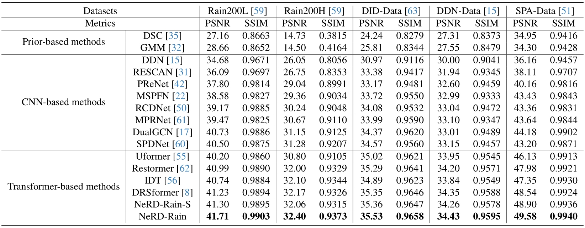

# 【CVPR'2024🔥】Bidirectional Multi-Scale Implicit Neural Representations for Image Deraining
</div>

> Bidirectional Multi-Scale Implicit Neural Representations for Image Deraining
>
> [Xiang Chen](https://cschenxiang.github.io/), [Jinshan Pan](https://jspan.github.io/), [Jiangxin Dong](https://scholar.google.com/citations?user=ruebFVEAAAAJ&hl=en&oi=ao)
>
> Nanjing University of Science and Technology
>
> Primary contact: Xiang Chen (chenxiang@njust.edu.cn)

Welcome to visit our website (专注底层视觉领域的信息服务平台) for low-level vision: https://lowlevelcv.com/


## 📣 News
- [24-04-03] The paper is available [here](https://arxiv.org/abs/2404.01547).   
- [24-03-20] The source codes, models and results are available.
- [24-02-27] Our paper has been accepted to CVPR 2024.

## 📖 Research Website: [[link]](http://www.deraining.tech/) (A Survey on Image Deraining)
 
## 📌 Overview


## 🔑 Setup
Type the command:
```
pip install -r requirements.txt
```

Install warmup scheduler

```
cd pytorch-gradual-warmup-lr; python setup.py install; cd ..
```

## 🧩 Dataset Preparation
| Datasets | Download Link | 
|:-----: |:-----: |
| Rain200L | [Baidu Netdisk](https://pan.baidu.com/s/1rTb4qU3fCEA4MRpQss__DA?pwd=s2yx) (s2yx) |
| Rain200H | [Baidu Netdisk](https://pan.baidu.com/s/1KK8R2bPKgcOX8gMXSuKtCQ?pwd=z9br) (z9br) |
| DID-Data | [Baidu Netdisk](https://pan.baidu.com/s/1aPFJExxxTBOzJjngMAOQDA?pwd=5luo) (5luo) |
| DDN-Data | [Baidu Netdisk](https://pan.baidu.com/s/1g_m7RfSUJUtknlWugO1nrw?pwd=ldzo) (ldzo) |
| SPA-Data | [Baidu Netdisk](https://pan.baidu.com/s/1YfxC5OvgYcQCffEttFz8Kg?pwd=yjow) (yjow) |


## 🛠️ Training and Testing
1. Please download the corresponding datasets and put them in the folder `Datasets/`.
2. Follow the instructions below to begin training our model.
```
bash train.sh
```
Run the script then you can find the generated experimental logs in the folder `checkpoints`.

3. Follow the instructions below to begin testing our model.
```
python test.py
```
Run the script then you can find the output visual results in the folder `results/`.


## 🤖 Pre-trained Models
| Models | NeRD-Rain-S | NeRD-Rain |
|:-----: |:-----: |:-----: |
| Rain200L | [Google Drive](https://drive.google.com/file/d/1Grzb8ga_1tZEIMGXhtF_W2cDHS4Dq-Lz/view?usp=sharing) / [Baidu Netdisk](https://pan.baidu.com/s/1pnsPFIzxpIStYnjffQ9oOw?pwd=thga) (thga) | [Google Drive](https://drive.google.com/file/d/14pAgjJu8txIy7KD-7iB089U7jysnARrW/view?usp=sharing) / [Baidu Netdisk](https://pan.baidu.com/s/1guDBWLjihXY1ChZuX5keBw?pwd=ub1n) (ub1n) |
| Rain200H | [Google Drive](https://drive.google.com/file/d/1WXjrM50r7m8YjPKZOqmfNeJU57WEjZzc/view?usp=sharing) / [Baidu Netdisk](https://pan.baidu.com/s/1Pl8wuHuRc8Uqt6lrh3IywA?pwd=twg1) (twg1) | [Google Drive](https://drive.google.com/file/d/1MOG3ZrXQxH-o13O1QWB6EiZhJsXOlUXs/view?usp=sharing) / [Baidu Netdisk](https://pan.baidu.com/s/1S_Yp3bbHJZjgF1nI9qXzCA?pwd=x45q) (x45q) |
| DID-Data | [Google Drive](https://drive.google.com/file/d/12drqRA6tVv_k_y3WCuFVIBEEHKe6KTsr/view?usp=sharing) / [Baidu Netdisk](https://pan.baidu.com/s/1fqqIOwxdKHVhga5FAnGG1g?pwd=bljv) (bljv) | [Google Drive](https://drive.google.com/file/d/10uvLyC0NjbOWAEfFgB9nDEQDHC_CB8KC/view?usp=sharing) / [Baidu Netdisk](https://pan.baidu.com/s/1Blt5D2nXMFwuC0PcbbDy2g?pwd=n37f) (n37f) |
| DDN-Data | [Google Drive](https://drive.google.com/file/d/1oonCvgCEjDQXHuGBRkdZ5DmE33zv6Rt7/view?usp=sharing) / [Baidu Netdisk](https://pan.baidu.com/s/1I3eLobpDrXPQo7_3JMp0Mw?pwd=10ut) (10ut) | [Google Drive](https://drive.google.com/file/d/1KYiW5lYFrgP5AsImF94-fpXw5B0NdR4K/view?usp=sharing) / [Baidu Netdisk](https://pan.baidu.com/s/1IhXwpNJEqTbLaw7AC88CSg?pwd=01m0) (01m0) |
| SPA-Data | [Google Drive](https://drive.google.com/file/d/1oO5Q4ZDFF983uXL2isYzzdV3BwPXY0Ru/view?usp=sharing) / [Baidu Netdisk](https://pan.baidu.com/s/1vbS9RTLGrRnsKp6uQ2zt5Q?pwd=p7h9) (p7h9) | [Google Drive](https://drive.google.com/file/d/1c3lLvRQACii_-9hJLA_J4mgZePWNXWLR/view?usp=sharing) / [Baidu Netdisk](https://pan.baidu.com/s/1J5CJ8ehNB0EUqQdtlPdMEA?pwd=mhkn) (mhkn) |


## 🚨 Performance Evaluation
See folder "evaluations" 

1) *for Rain200L/H and SPA-Data datasets*: 
PSNR and SSIM results are computed by using this [Matlab Code](https://github.com/cschenxiang/NeRD-Rain/tree/main/evaluations/Evalution_Rain200L_Rain200H_SPA-Data).

2) *for DID-Data and DDN-Data datasets*: 
PSNR and SSIM results are computed by using this [Matlab Code](https://github.com/cschenxiang/NeRD-Rain/tree/main/evaluations/Evaluation_DID-Data_DDN-Data).



## 🚀 Visual Deraining Results
| Methods | DualGCN | SPDNet | Uformer | Restormer |
|:-----: |:-----: |:-----: |:-----: |:-----: |
| Rain200L | [Baidu Netdisk](https://pan.baidu.com/s/1o9eLMv7Zfk_GC9F4eWC2kw?pwd=v8qy) (v8qy) | [Baidu Netdisk](https://pan.baidu.com/s/1u9F4IxA8GCxKGk6__W81Og?pwd=y39h) (y39h) | [Baidu Netdisk]() (N/A) |[Baidu Netdisk](https://pan.baidu.com/s/1jv6PUMO7h_Tc4ovrCLQsSw?pwd=6a2z) (6a2z) |
| Rain200H | [Baidu Netdisk](https://pan.baidu.com/s/1QiKh5fTV-QSdnwMsZdDe9Q?pwd=jnc9) (jnc9) | [Baidu Netdisk](https://pan.baidu.com/s/1wSTwW6ewBUgNLj7l7i6HzQ?pwd=mry2) (mry2) | [Baidu Netdisk]() (N/A) |[Baidu Netdisk](https://pan.baidu.com/s/16R0YamX-mfn6j9sYP7QpvA?pwd=9m1r) (9m1r) |
| DID-Data | [Baidu Netdisk](https://pan.baidu.com/s/1Wh7eJdOwXPABz5aOBPDHaA?pwd=3gdx) (3gdx) | [Baidu Netdisk](https://pan.baidu.com/s/1z3b60LHOyi8MLcn8fdNc8A?pwd=klci) (klci) | [Baidu Netdisk](https://pan.baidu.com/s/1fWLjSCSaewz1QXdddkpkIw?pwd=4uur) (4uur) |[Baidu Netdisk](https://pan.baidu.com/s/1b8lrKE82wgM8RiYaMI6ZQA?pwd=1hql) (1hql) |
| DDN-Data | [Baidu Netdisk](https://pan.baidu.com/s/1ML1A1boxwX38TGccTzr6KA?pwd=1mdx) (1mdx) | [Baidu Netdisk](https://pan.baidu.com/s/130e74ISgZtlaw8w6ZzJgvQ?pwd=19bm) (19bm) | [Baidu Netdisk](https://pan.baidu.com/s/1cWY7piDJRF05qKYPNXt_cA?pwd=39bj) (39bj) |[Baidu Netdisk](https://pan.baidu.com/s/1GGqsfUOdoxod9vAUxB54PA?pwd=crj4) (crj4) |
| SPA-Data | [Baidu Netdisk](https://pan.baidu.com/s/16RHVyrBoPnOhW1QuglRmlw?pwd=lkeb) (lkeb) | [Baidu Netdisk](https://pan.baidu.com/s/1J0ybwnuT__ZGQZNbMTfw8Q?pwd=dd98) (dd98) | [Baidu Netdisk]() (N/A) |[Baidu Netdisk](https://pan.baidu.com/s/1IG4T1Bz--FrDAuV6o-fykA?pwd=b40z) (b40z) |

| Methods | IDT | DRSformer | NeRD-Rain-S | NeRD-Rain |
|:-----: |:-----: |:-----: |:-----: |:-----: |
| Rain200L | [Baidu Netdisk](https://pan.baidu.com/s/1jhHCHT64aDknc4g0ELZJGA?pwd=v4yd) (v4yd) | [Baidu Netdisk](https://pan.baidu.com/s/1-ElpyJigVnpt5xDFE6Pqqw?pwd=hyuv) (hyuv) | [Baidu Netdisk](https://pan.baidu.com/s/1TXVBhM89eCyFoZVCUHwVnw?pwd=tur9) (tur9) |[Baidu Netdisk](https://pan.baidu.com/s/1473-AWrtgQJ1bwiMfbJ50Q?pwd=jdir) (jdir) | 
| Rain200H | [Baidu Netdisk](https://pan.baidu.com/s/10TZzZH0HisPV0Mw-E4SlTQ?pwd=77i4) (77i4) | [Baidu Netdisk](https://pan.baidu.com/s/13aJKxH7V_6CIAynbkHXIyQ?pwd=px2j) (px2j) | [Baidu Netdisk](https://pan.baidu.com/s/1_1DKQnDJ9DvehevYogyN_Q?pwd=g05m) (g05m) |[Baidu Netdisk](https://pan.baidu.com/s/1XByfzKxR1cD10wYmT6y84w?pwd=2l0w) (2l0w) |
| DID-Data | [Baidu Netdisk](https://pan.baidu.com/s/1svMZAUvs6P6RRNGyCTaeAA?pwd=8uxx) (8uxx) | [Baidu Netdisk](https://pan.baidu.com/s/1Xl3q05rZYmNEtQp5eLTTKw?pwd=t879) (t879) | [Baidu Netdisk](https://pan.baidu.com/s/1zMApqltjcGXhq-GcAKgzww?pwd=p2h6) (p2h6) |[Baidu Netdisk](https://pan.baidu.com/s/1pXakvN2gEIydtIMr55MEdw?pwd=yerc) (yerc) | 
| DDN-Data | [Baidu Netdisk](https://pan.baidu.com/s/1FSf3-9HEIQ-lLGRWesyszQ?pwd=0ey6) (0ey6) | [Baidu Netdisk](https://pan.baidu.com/s/1D36Z0cEVPPbm5NljV-8yoA?pwd=9vtz) (9vtz) | [Baidu Netdisk](https://pan.baidu.com/s/1nQnl3KU2IoS8k0mvnOIlYA?pwd=f10x) (f10x) |[Baidu Netdisk](https://pan.baidu.com/s/1yYGClC3q150lHn1OyoJOrQ?pwd=6stc) (6stc) |
| SPA-Data | [Baidu Netdisk](https://pan.baidu.com/s/16hfo5VeUhzu6NYdcgf7-bg?pwd=b862) (b862) | [Baidu Netdisk](https://pan.baidu.com/s/1Rc36xXlfaIyx3s2gqUg_Bg?pwd=bl4n) (bl4n) | [Baidu Netdisk](https://pan.baidu.com/s/1sjxJAsQie7a392YC3RkIfg?pwd=c6ky) (c6ky) |[Baidu Netdisk](https://pan.baidu.com/s/171D2Bd4NI6TTWCEkr3L0sA?pwd=5ctk) (5ctk) |

[Download by Google Drive](https://drive.google.com/file/d/1lH7r_qXUmvhCHq91RtJiNBUK6PF4E60X/view?usp=sharing) 

## 🔎  More Results
| Methods | Models | Descriptions | 
|:-----: |:-----: |:-----: |
| [model_MPRNet.py](https://github.com/cschenxiang/NeRD-Rain/blob/main/Ablations/model_MPRNet.py) | [Google Drive](https://drive.google.com/file/d/1NzObBRbrrYPZE4V52o-H1G8r0r54Efta/view?usp=sharing) | Extension to CNN-based UNet, see Table 6. |

## 👍 Acknowledgement
Thanks for their awesome works ([DeepRFT](https://github.com/INVOKERer/DeepRFT) and [NeRCo](https://github.com/Ysz2022/NeRCo)).

## 📘 Citation
Please consider citing our work as follows if it is helpful.
```
@InProceedings{NeRD-Rain,
    author={Chen, Xiang and Pan, Jinshan and Dong, Jiangxin}, 
    title={Bidirectional Multi-Scale Implicit Neural Representations for Image Deraining},
    booktitle={Proceedings of the IEEE/CVF Conference on Computer Vision and Pattern Recognition (CVPR)},
    month={June},
    year={2024}
}
```
