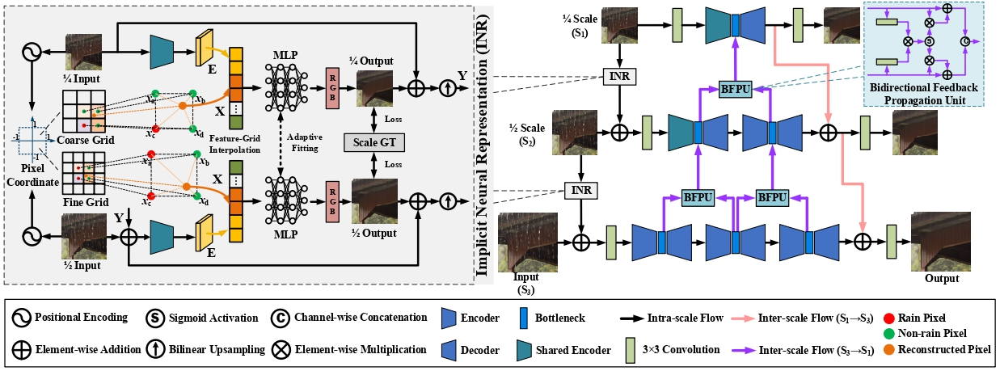

<div align="center">

# 【CVPR'2024🔥】Bidirectional Multi-Scale Implicit Neural Representations for Image Deraining
</div>

> Bidirectional Multi-Scale Implicit Neural Representations for Image Deraining
>
> [Xiang Chen](https://cschenxiang.github.io/), [Jinshan Pan](https://jspan.github.io/), [Jiangxin Dong](https://scholar.google.com/citations?user=ruebFVEAAAAJ&hl=en&oi=ao)
>
> Nanjing University of Science and Technology
>
> Primary contact: Xiang Chen (chenxiang@njust.edu.cn)

## 📣 News
- [24-02-27] Our paper has been accepted to CVPR 2024.

## 📌 Overview


## 🔑 Setup
Type the command:
```
pip install -r requirements.txt
```

## 🧩 Dataset Preparation
| Datasets | Download Link | 
|:-----: |:-----: |
| Rain200L | [Baidu Netdisk](https://pan.baidu.com/s/1rTb4qU3fCEA4MRpQss__DA?pwd=s2yx) (s2yx) |
| Rain200H | [Baidu Netdisk](https://pan.baidu.com/s/1KK8R2bPKgcOX8gMXSuKtCQ?pwd=z9br) (z9br) |
| DID-Data | [Baidu Netdisk](https://pan.baidu.com/s/1aPFJExxxTBOzJjngMAOQDA?pwd=5luo) (5luo) |
| DDN-Data | [Baidu Netdisk](https://pan.baidu.com/s/1g_m7RfSUJUtknlWugO1nrw?pwd=ldzo) (ldzo) |
| SPA-Data | [Baidu Netdisk](https://pan.baidu.com/s/1YfxC5OvgYcQCffEttFz8Kg?pwd=yjow) (yjow) |


## 🚀 Visual Deraining Results
| Datasets | DualGCN | SPDNet | Uformer | Restormer |
|:-----: |:-----: |:-----: |:-----: |:-----: |
| Rain200L | [Baidu Netdisk](https://pan.baidu.com/s/1rTb4qU3fCEA4MRpQss__DA?pwd=s2yx) (s2yx) | [Baidu Netdisk](https://pan.baidu.com/s/1rTb4qU3fCEA4MRpQss__DA?pwd=s2yx) (s2yx) | [Baidu Netdisk](https://pan.baidu.com/s/1rTb4qU3fCEA4MRpQss__DA?pwd=s2yx) (s2yx) |[Baidu Netdisk](https://pan.baidu.com/s/1rTb4qU3fCEA4MRpQss__DA?pwd=s2yx) (s2yx) | [Baidu Netdisk](https://pan.baidu.com/s/1rTb4qU3fCEA4MRpQss__DA?pwd=s2yx) (s2yx) |
| Rain200H | [Baidu Netdisk](https://pan.baidu.com/s/1rTb4qU3fCEA4MRpQss__DA?pwd=s2yx) (s2yx) | [Baidu Netdisk](https://pan.baidu.com/s/1rTb4qU3fCEA4MRpQss__DA?pwd=s2yx) (s2yx) | [Baidu Netdisk](https://pan.baidu.com/s/1rTb4qU3fCEA4MRpQss__DA?pwd=s2yx) (s2yx) |[Baidu Netdisk](https://pan.baidu.com/s/1rTb4qU3fCEA4MRpQss__DA?pwd=s2yx) (s2yx) | [Baidu Netdisk](https://pan.baidu.com/s/1rTb4qU3fCEA4MRpQss__DA?pwd=s2yx) (s2yx) |
| DID-Data | [Baidu Netdisk](https://pan.baidu.com/s/1rTb4qU3fCEA4MRpQss__DA?pwd=s2yx) (s2yx) | [Baidu Netdisk](https://pan.baidu.com/s/1rTb4qU3fCEA4MRpQss__DA?pwd=s2yx) (s2yx) | [Baidu Netdisk](https://pan.baidu.com/s/1rTb4qU3fCEA4MRpQss__DA?pwd=s2yx) (s2yx) |[Baidu Netdisk](https://pan.baidu.com/s/1rTb4qU3fCEA4MRpQss__DA?pwd=s2yx) (s2yx) | [Baidu Netdisk](https://pan.baidu.com/s/1rTb4qU3fCEA4MRpQss__DA?pwd=s2yx) (s2yx) |
| DDN-Data | [Baidu Netdisk](https://pan.baidu.com/s/1rTb4qU3fCEA4MRpQss__DA?pwd=s2yx) (s2yx) | [Baidu Netdisk](https://pan.baidu.com/s/1rTb4qU3fCEA4MRpQss__DA?pwd=s2yx) (s2yx) | [Baidu Netdisk](https://pan.baidu.com/s/1rTb4qU3fCEA4MRpQss__DA?pwd=s2yx) (s2yx) |[Baidu Netdisk](https://pan.baidu.com/s/1rTb4qU3fCEA4MRpQss__DA?pwd=s2yx) (s2yx) | [Baidu Netdisk](https://pan.baidu.com/s/1rTb4qU3fCEA4MRpQss__DA?pwd=s2yx) (s2yx) |
| SPA-Data | [Baidu Netdisk](https://pan.baidu.com/s/1rTb4qU3fCEA4MRpQss__DA?pwd=s2yx) (s2yx) | [Baidu Netdisk](https://pan.baidu.com/s/1rTb4qU3fCEA4MRpQss__DA?pwd=s2yx) (s2yx) | [Baidu Netdisk](https://pan.baidu.com/s/1rTb4qU3fCEA4MRpQss__DA?pwd=s2yx) (s2yx) |[Baidu Netdisk](https://pan.baidu.com/s/1rTb4qU3fCEA4MRpQss__DA?pwd=s2yx) (s2yx) | [Baidu Netdisk](https://pan.baidu.com/s/1rTb4qU3fCEA4MRpQss__DA?pwd=s2yx) (s2yx) |

| Datasets | IDT | DRSformer | NeRD-Rain-S | NeRD-Rain |
|:-----: |:-----: |:-----: |:-----: |:-----: |
| Rain200L | [Baidu Netdisk](https://pan.baidu.com/s/1rTb4qU3fCEA4MRpQss__DA?pwd=s2yx) (s2yx) | [Baidu Netdisk](https://pan.baidu.com/s/1rTb4qU3fCEA4MRpQss__DA?pwd=s2yx) (s2yx) | [Baidu Netdisk](https://pan.baidu.com/s/1rTb4qU3fCEA4MRpQss__DA?pwd=s2yx) (s2yx) |[Baidu Netdisk](https://pan.baidu.com/s/1rTb4qU3fCEA4MRpQss__DA?pwd=s2yx) (s2yx) | [Baidu Netdisk](https://pan.baidu.com/s/1rTb4qU3fCEA4MRpQss__DA?pwd=s2yx) (s2yx) |
| Rain200H | [Baidu Netdisk](https://pan.baidu.com/s/1rTb4qU3fCEA4MRpQss__DA?pwd=s2yx) (s2yx) | [Baidu Netdisk](https://pan.baidu.com/s/1rTb4qU3fCEA4MRpQss__DA?pwd=s2yx) (s2yx) | [Baidu Netdisk](https://pan.baidu.com/s/1rTb4qU3fCEA4MRpQss__DA?pwd=s2yx) (s2yx) |[Baidu Netdisk](https://pan.baidu.com/s/1rTb4qU3fCEA4MRpQss__DA?pwd=s2yx) (s2yx) | [Baidu Netdisk](https://pan.baidu.com/s/1rTb4qU3fCEA4MRpQss__DA?pwd=s2yx) (s2yx) |
| DID-Data | [Baidu Netdisk](https://pan.baidu.com/s/1rTb4qU3fCEA4MRpQss__DA?pwd=s2yx) (s2yx) | [Baidu Netdisk](https://pan.baidu.com/s/1rTb4qU3fCEA4MRpQss__DA?pwd=s2yx) (s2yx) | [Baidu Netdisk](https://pan.baidu.com/s/1rTb4qU3fCEA4MRpQss__DA?pwd=s2yx) (s2yx) |[Baidu Netdisk](https://pan.baidu.com/s/1rTb4qU3fCEA4MRpQss__DA?pwd=s2yx) (s2yx) | [Baidu Netdisk](https://pan.baidu.com/s/1rTb4qU3fCEA4MRpQss__DA?pwd=s2yx) (s2yx) |
| DDN-Data | [Baidu Netdisk](https://pan.baidu.com/s/1rTb4qU3fCEA4MRpQss__DA?pwd=s2yx) (s2yx) | [Baidu Netdisk](https://pan.baidu.com/s/1rTb4qU3fCEA4MRpQss__DA?pwd=s2yx) (s2yx) | [Baidu Netdisk](https://pan.baidu.com/s/1rTb4qU3fCEA4MRpQss__DA?pwd=s2yx) (s2yx) |[Baidu Netdisk](https://pan.baidu.com/s/1rTb4qU3fCEA4MRpQss__DA?pwd=s2yx) (s2yx) | [Baidu Netdisk](https://pan.baidu.com/s/1rTb4qU3fCEA4MRpQss__DA?pwd=s2yx) (s2yx) |
| SPA-Data | [Baidu Netdisk](https://pan.baidu.com/s/1rTb4qU3fCEA4MRpQss__DA?pwd=s2yx) (s2yx) | [Baidu Netdisk](https://pan.baidu.com/s/1rTb4qU3fCEA4MRpQss__DA?pwd=s2yx) (s2yx) | [Baidu Netdisk](https://pan.baidu.com/s/1rTb4qU3fCEA4MRpQss__DA?pwd=s2yx) (s2yx) |[Baidu Netdisk](https://pan.baidu.com/s/1rTb4qU3fCEA4MRpQss__DA?pwd=s2yx) (s2yx) | [Baidu Netdisk](https://pan.baidu.com/s/1rTb4qU3fCEA4MRpQss__DA?pwd=s2yx) (s2yx) |


## 👍 Acknowledgement
Thanks for their awesome works ([DeepRFT](https://github.com/INVOKERer/DeepRFT) and [NeRCo](https://github.com/Ysz2022/NeRCo)).

## 📘 Citation
Please consider citing our work as follows if it is helpful.
```
@InProceedings{NeRD-Rain,
    author={Chen, Xiang and Pan, Jinshan and Dong, Jiangxin}, 
    title={Bidirectional Multi-Scale Implicit Neural Representations for Image Deraining},
    booktitle={Proceedings of the IEEE/CVF Conference on Computer Vision and Pattern Recognition (CVPR)},
    month={June},
    year={2024}
}
```

